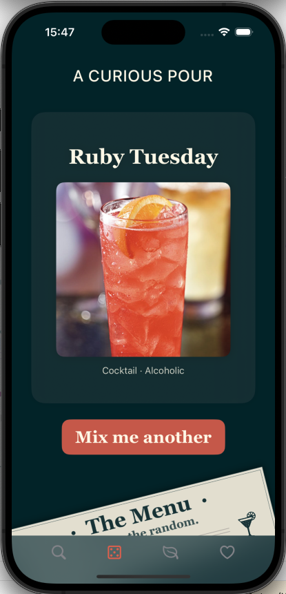
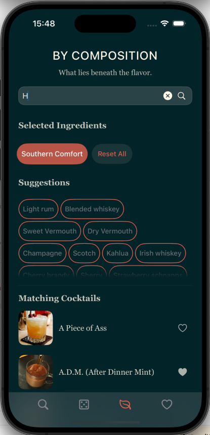
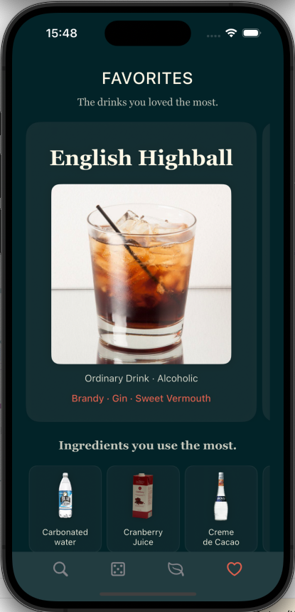

# 🍸 Cocktail Explorer

**A clean SwiftUI prototype for browsing and mixing cocktails.**  
Built as a personal practice project to work with:
- ✅ SwiftUI basics
- ✅ MVVM pattern
- ✅ Async data fetching
- ✅ Smooth fade & scale animations

---

## 📱 Screenshots

  
  
  

---

## ✨ Features

- 🔍 **Search & Filter:** Find cocktails by name, category or ingredients.
- 🍹 **Randomizer:** Get a random drink or refine it by category.
- ❤️ **Favorites:** Mark your drinks and view them later.
- ⚙️ **MVVM Architecture:** Simple & clean state management.
- 🎨 **Subtle Animations:** Smooth fade/scale transitions for better UX.

---

## 🚩 Known limitations

This version is **optimized for common iPhone screen sizes**.  
Small screens (e.g. iPhone SE) and iPad layouts may break the current layout — fixing this would require a dedicated responsive pass.

Also, there are a few open polish tasks:
- Ingredient chips sometimes shift width when selected.
- Small visual tweaks on button paddings and shadow effects could be refined.
- Some layout values and fonts can be unified better for consistency.

---

## 🗂️ TODO / Next Steps

- [ ] Polish responsive design for small screens & iPad.
- [ ] Revisit ingredient chip layout for more stable sizing.
- [ ] Add more subtle animations (e.g. smoother appear/disappear of filtered blocks).
- [ ] Add unit/UI tests for basic flows.
- [ ] Optional: Polish `README` with GIF preview or screen recording.

---

## 🚀 Status

**Prototype complete & published.**  
This project will stay open for possible micro-improvements, but major extensions (like full iPad split views) are out of scope for this version.

---

## ✅ Tags

#SwiftUI #MVVM #iOS #Practice

---

**Made with 🍸 + SwiftUI for learning & fun.**
